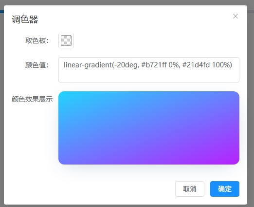
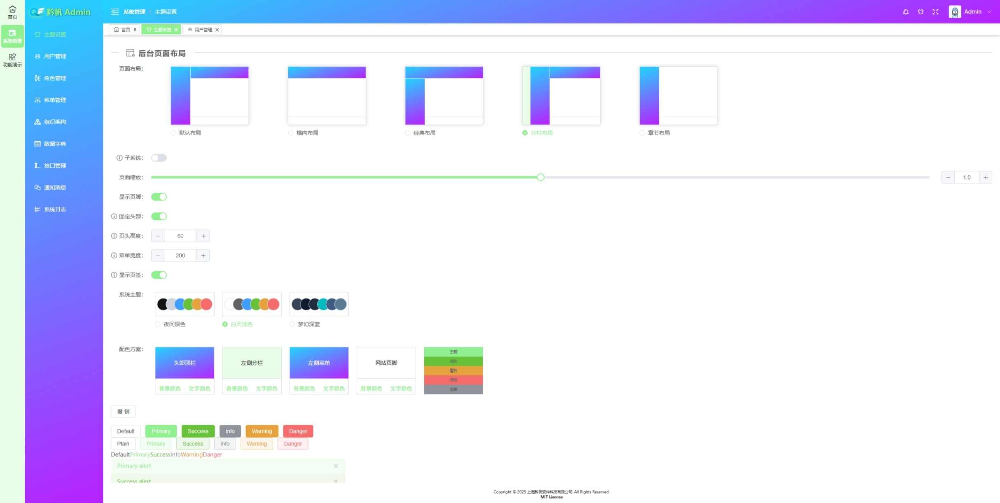

# QinfanAdmin
&emsp;&emsp;杨工是一个后端开发工程师，但是平时工作都是前后端一块儿做，这些年各类 JS 库皆有涉及，页面 UI 组件也大差不差，工作经验的积累，前端也略有成长，今而立之年，故总结一下经验与技术。      
&emsp;&emsp;项目在 2025年8月下旬将提交一个精简版，供大家交流学习，还望各位指教，有兴趣的朋友可以帮忙贡献代码，感谢！          

> 
> **注意：** 目前项目中的代码为最初创建项目之初的源码，不可运行，也并不是现在的效果，精简版将在2025年8月下旬提交，望期待与 Start 分享。       
> 


## 项目介绍      
&emsp;&emsp;QinfanAdmin 是一个基于 Vue3.0 + Vite + Pinia + Element Plus + JavaScript + Vue Router 等技术栈，实现了多主题、多布局、多页签、页面模板等功能，具备高度可定制化，可以快速构建企业级后台管理系统。       

> **阅览地址：** [https://yangdawen8088.github.io/QianfanAdmin/#/Backend/Dashboard](https://yangdawen8088.github.io/QianfanAdmin/#/Backend/Dashboard)

## 项目特点     
### 1、搭载常规的 5 种布局切换：     
&emsp;&emsp;五种布局切换自带渐进性过度动画，让页面更加丝滑无痕，提升用户体验。切换布局，路由组件不会被销毁，而是复用，提升性能与用户体验。
<div style="text-align: center;">


</div>

### 2、具备 3 种主题随意切换：     
&emsp;&emsp;系统自带三种主题，用户可以根据自己的喜好进行切换，也可以自行快速创建主题效果，配色可以基于主题进行二次创作修改。         
<div style="text-align: center;">


</div>

### 3、多个模块支持渐变色自定义：     
&emsp;&emsp;系统头部、菜单栏、页脚等支持渐变色纯色等多种配色方案，让系统主题更具特色，主题色与功能色可以自用设置。         
<div style="text-align: center;">




</div>

### 4、页面路由页签切换：     
&emsp;&emsp;页签功能可自行定义样式方案，可以设置显示与隐藏，可以进行拖拽排序与关闭等多种功能，右键单击弹出菜单显示更多功能。      
<div style="text-align: center;">

</div>
### 5、页面模板封装：     
&emsp;&emsp;页面尺寸自适应系统框架尺寸，封装模板，简单配置实现复杂页面功能，减少页面代码开发，增加模块开发工作效率。      
<div style="text-align: center;">

</div>

## 安装依赖包
```
npm install
```

### 在开发环境启动项目
```
npm run dev
```

### 构建打包生产环境程序包
```
npm run build
```